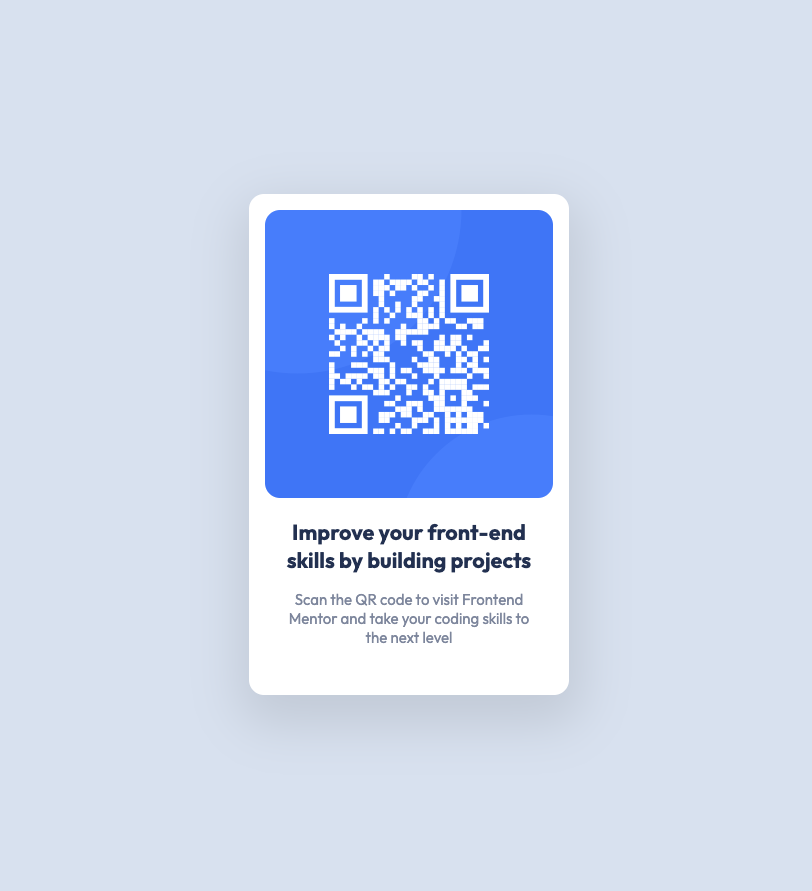

# Frontend Mentor - QR code component solution

This is a solution to the [QR code component challenge on Frontend Mentor](https://www.frontendmentor.io/challenges/qr-code-component-iux_sIO_H). Frontend Mentor challenges help you improve your coding skills by building realistic projects.

## Table of contents

- [Overview](#overview)
  - [Screenshot](#screenshot)
- [My process](#my-process)
  - [Built with](#built-with)
  - [What I learned](#what-i-learned)

## Overview

### Screenshot

## My process

### Built with

- Semantic HTML5 markup
- CSS custom properties
- Flexbox

### What I learned

Loading fonts is an interesting concept, as I have always been a fan of having everything locally served. However, fonts have become much more intensive having variable fonts where there is a seperate file for each font weight and a seperate file to accomodate each browser. Using the tool [google-webfonts-helper](https://gwfh.mranftl.com/fonts) helps with this however it is easier just adding the `link` tag.

If you want more help with writing markdown, we'd recommend checking out [The Markdown Guide](https://www.markdownguide.org/) to learn more.
